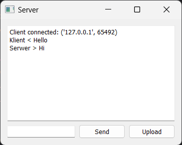
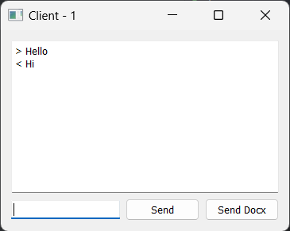

# chat_room
This Python application is a simple communicator that consists of both a server and client component, allowing users to communicate.
Running the main script opens both the server and client sides on localhost.

## app
 